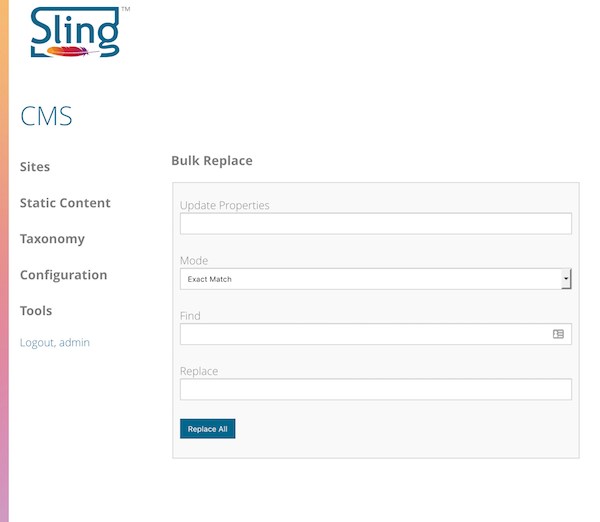
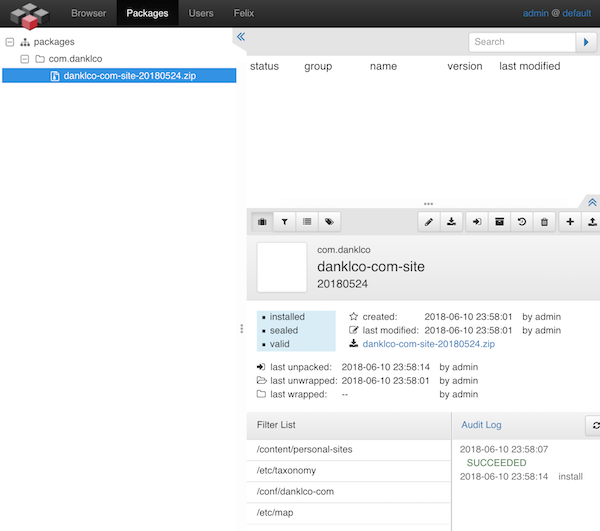
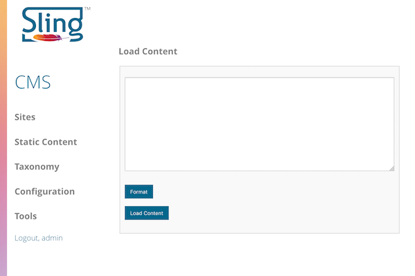
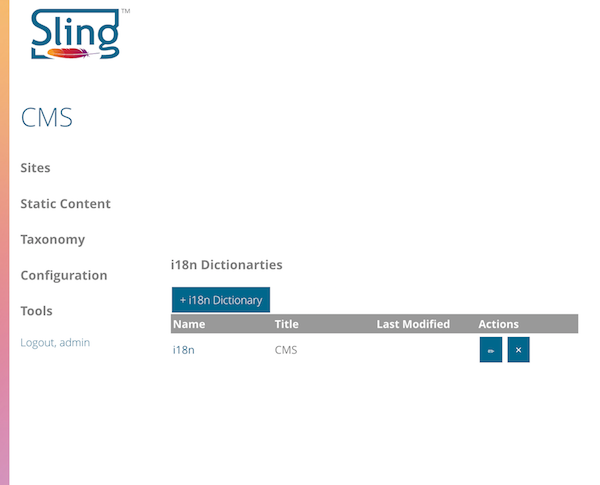
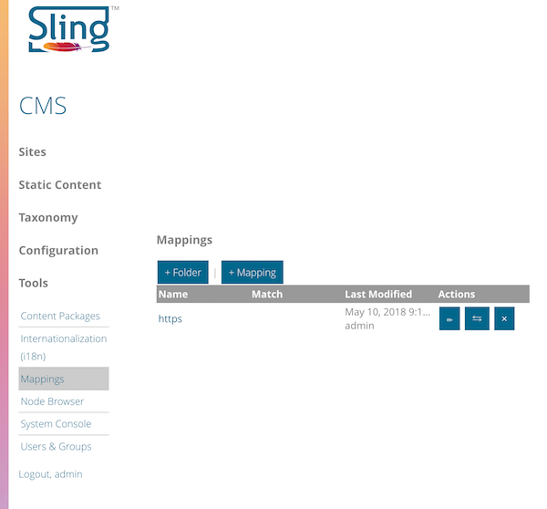
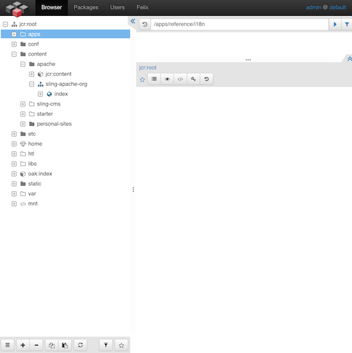
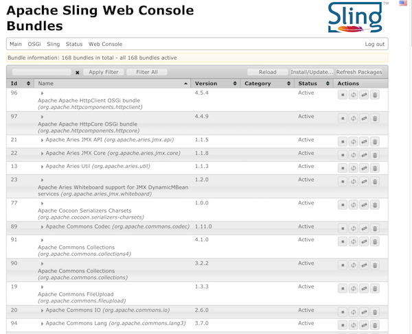
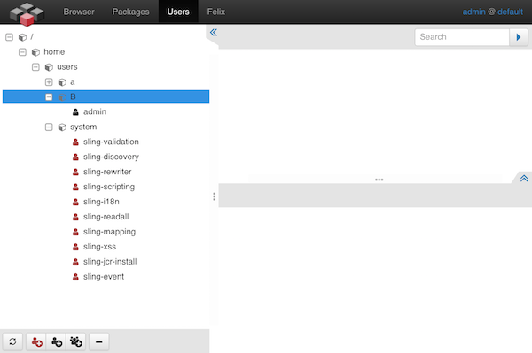

<!-- Licensed to the Apache Software Foundation (ASF) under one or more contributor 
	license agreements. See the NOTICE file distributed with this work for additional 
	information regarding copyright ownership. The ASF licenses this file to 
	you under the Apache License, Version 2.0 (the "License"); you may not use 
	this file except in compliance with the License. You may obtain a copy of 
	the License at http://www.apache.org/licenses/LICENSE-2.0 Unless required 
	by applicable law or agreed to in writing, software distributed under the 
	License is distributed on an "AS IS" BASIS, WITHOUT WARRANTIES OR CONDITIONS 
	OF ANY KIND, either express or implied. See the License for the specific 
	language governing permissions and limitations under the License. -->
[Apache Sling](https://sling.apache.org) > [Sling CMS](https://github.com/apache/sling-org-apache-sling-app-cms) > [Administration](administration.md) > Administrative Tools

# Administrative Tools

There are a number of administrative tools to help make administering Sling CMS easier, they include:

## Bulk Replace

This tool can be accessed  from *Tools > Content Import* or at [http://localhost:8080/cms/admin/bulkreplace.html](http://localhost:8080/cms/admin/bulkreplace.html). First, select the path under which to perform the bulk replacement, then specify replacement configuration. This will find and replace the target term with the replacement term in all matching properties.

## Content Packages

This is accessible from *Tools > Content Packages* or at [http://localhost:8080/bin/packages.html/](http://localhost:8080/bin/packages.html/) and allows administrators to create, upload and download ZIP based packages of content using the Jackrabbit VLT packaging tool.

## Load Content

This tool can be accessed from *Tools > Load Content* or at [http://localhost:8080/cms/admin/loadcontent.html](http://localhost:8080/cms/admin/loadcontent.html). First specify the path under which to load the content, then the import configuration This will load a string of content into the Sling CMS repository.

## Internationalization

This console is accessible from *Tools > Internationalization* or at [http://localhost:8080/cms/i18n/dictionaries.html/etc/i18n](http://localhost:8080/cms/i18n/dictionaries.html/etc/i18n) This allows you to specify i18n dictionaries for translating text to multiple languages. 

## Mappings

This console is accessible from *Tools > Mappings* or at [http://localhost:8080/cms/mappings/list.html/etc/map](http://localhost:8080/cms/mappings/list.html/etc/map). Allows you to create and manage Sling Mappings which are used to map content based on the requested URL to the Sling repository.

## Node Browser

This tool is accessible from *Tools > Node Browser* or at [http://localhost:8080/bin/browser.html](http://localhost:8080/bin/browser.html). Allows you to view and modify the underling node structure of the Sling repository.

## System Console

This console is accessible from *Tools > System Console* or at [http://localhost:8080/system/console](http://localhost:8080/system/console). The OSGi Console contains several administrative tools allowing administrators to install and manage bundles, configure logging, configure services and many other tasks.

# Users & Groups

This tool is accessible from *Tools > Users & Groups* or at [http://localhost:8080/cms/auth/list.html/home](http://localhost:8080/cms/auth/list.html/home). It allows administrators to create and manage users and groups within Sling CMS. Permissions are managed in the Node Browser