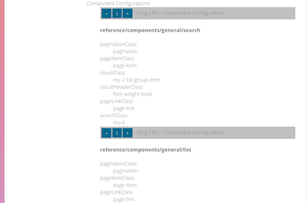
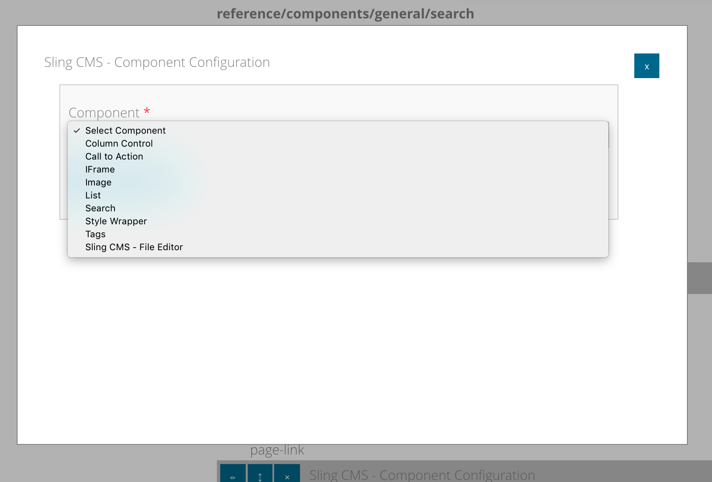

<!-- Licensed to the Apache Software Foundation (ASF) under one or more contributor
	license agreements. See the NOTICE file distributed with this work for additional
	information regarding copyright ownership. The ASF licenses this file to
	you under the Apache License, Version 2.0 (the "License"); you may not use
	this file except in compliance with the License. You may obtain a copy of
	the License at http://www.apache.org/licenses/LICENSE-2.0 Unless required
	by applicable law or agreed to in writing, software distributed under the
	License is distributed on an "AS IS" BASIS, WITHOUT WARRANTIES OR CONDITIONS
	OF ANY KIND, either express or implied. See the License for the specific
	language governing permissions and limitations under the License. -->
[Apache Sling](https://sling.apache.org) > [Sling CMS](https://github.com/apache/sling-org-apache-sling-app-cms) > [Administration](administration.md) > Component Policy

# Component Policy

Component policies control what components can be placed within [containers](page-editing.md#containers) and the configurations for the components. They should be referenced from [page templates](templates.md).

## Creating a Component Policy

Component policies should be created at the path /conf/[config_name]/site/policies with the Configuration Type "Sling CMS - Component Policies"

Once the configuration is created, policies can be added by clicking + in the container and adding a "Sling CMS - Component Policy" component.

## Configuring a Component policy

Select the top pencil to configure the Component Policy. Component Policies have the following fields:

1. **Title** - the user friendly title for the Component Policy
2. **Available Component Types** - The component types which will be available in containers using this component policy

## Component Configurations

Component configurations are used to share configurations values with all of the pages using the template.

To add a new component configuration:

1. Select the + button on the Component Configurations container
2. Select the Component Type *Sling CMS - Component Configuration*
3. Select *Add Component*
4. Click the Pencil button on the new Component Configuration
5. Select the component you want to configure from the Component dropdown, this will load the configuration fields for this component

