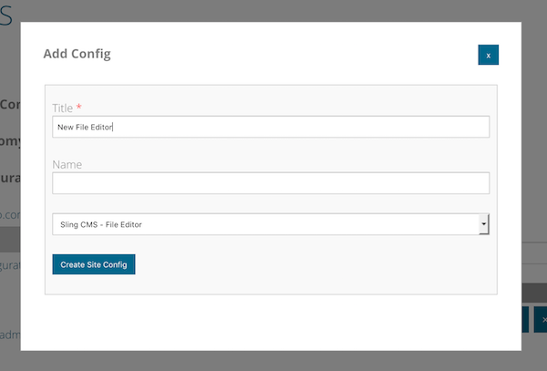
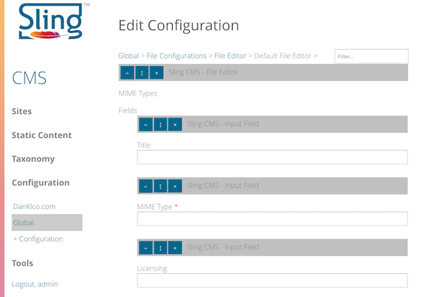

<!-- Licensed to the Apache Software Foundation (ASF) under one or more contributor 
	license agreements. See the NOTICE file distributed with this work for additional 
	information regarding copyright ownership. The ASF licenses this file to 
	you under the Apache License, Version 2.0 (the "License"); you may not use 
	this file except in compliance with the License. You may obtain a copy of 
	the License at http://www.apache.org/licenses/LICENSE-2.0 Unless required 
	by applicable law or agreed to in writing, software distributed under the 
	License is distributed on an "AS IS" BASIS, WITHOUT WARRANTIES OR CONDITIONS 
	OF ANY KIND, either express or implied. See the License for the specific 
	language governing permissions and limitations under the License. -->
[Apache Sling](https://sling.apache.org) > [Sling CMS](https://github.com/apache/sling-org-apache-sling-app-cms) > [Administration](administration.md) > Configure the File Editor

# Configure the File Editor

The file editor allows users to specify properties on all `sling:File` resources in a site. 

You can create different file editor configurations for different file types and different types. To add a configuration:

 1. Open the site configuration and create / open the sub-folders *files/editors*
 2. Click *+ Config* to create a new config and set the type to *Sling CMS - File Editor* 
    
 3. Click on the configuration to edit it and optionally set the applicable MimeType. If no mime type is set, the configuration will be considered as a default.
 4. Add the desired fields by adding them into the container
    