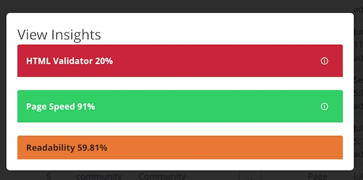
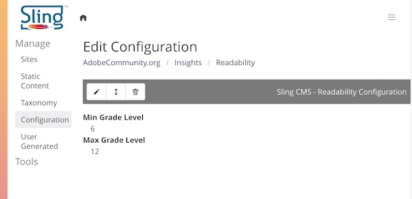
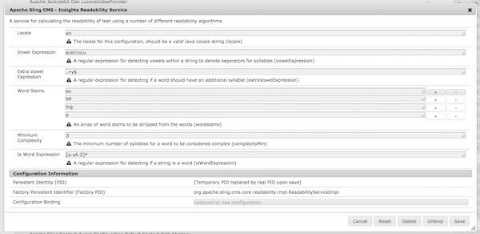

<!-- Licensed to the Apache Software Foundation (ASF) under one or more contributor 
    license agreements. See the NOTICE file distributed with this work for additional 
    information regarding copyright ownership. The ASF licenses this file to 
    you under the Apache License, Version 2.0 (the "License"); you may not use 
    this file except in compliance with the License. You may obtain a copy of 
    the License at http://www.apache.org/licenses/LICENSE-2.0 Unless required 
    by applicable law or agreed to in writing, software distributed under the 
    License is distributed on an "AS IS" BASIS, WITHOUT WARRANTIES OR CONDITIONS 
    OF ANY KIND, either express or implied. See the License for the specific 
    language governing permissions and limitations under the License. -->
[Apache Sling](https://sling.apache.org) > [Sling CMS](https://github.com/apache/sling-org-apache-sling-app-cms) > [Users](users.md) > Insights

# Content Insights

Content insights give you insights on the content in Sling CMS. Currently, three insight providers are included in Sling CMS and you can [create custom insight providers](insight-developers.md).

## HTML Validator

This insight uses the W3C HTML validator to validate the markup of your page and report any markup issues. It requires no configuration and can be run on any page.

## Page Speed

This insight uses Google Page Speed to analyze the page speed performance of a live page, so it will only work on published pages. 

### Configuring the Page Speed Insight

To use this insight, you must configure your Google API key at: http://[slingcms]/system/console/configMgr/org.apache.sling.cms.core.insights.impl.providers.PageSpeedInsightProvider

## Readability

This insight will calculate the readability of text, displaying a score based on whether or not a page's text falls within an expected readability grade boundary.

### Configuring the Readability Insight

This insight does require some configuration. At minimum, you must configure the readability grade level bounds. To do this:

 1. Navigate to your site's configuration root (e.g. http://localhost:8080/cms/config/list.html/conf/[sitename]
 2. Create or open the folder `insights`
 3. Click the _+ Config_ button to create a new configuration
 4. Select the option "Sling CMS - Readability Configuration" and set the title to "Readability"
 5. Configure the Min Grade Level and Max Grade Level
 
 
 
 You should now be able to use the Readability insight
 
 ### Adding Additional Languages
 
 Sling CMS provides a configuration for the Readability Insight for English. If you are authoring in another language, you can provide a configuration for your language. 
 
 1. Open the OSGi Configuration Console: http://localhost:8080/system/console/configMgr
 2. Find the "Apache Sling CMS - Insights Readability Service" and add a new configuration
 3. Set the language and provide the relevant configuration values
 
 
 