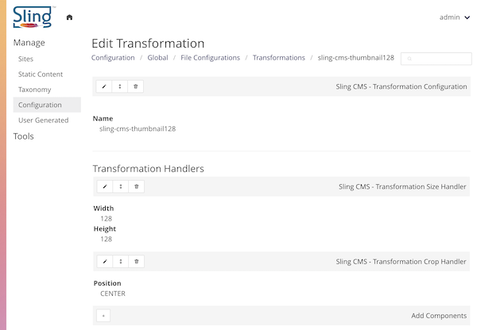

<!-- Licensed to the Apache Software Foundation (ASF) under one or more contributor
	license agreements. See the NOTICE file distributed with this work for additional
	information regarding copyright ownership. The ASF licenses this file to
	you under the Apache License, Version 2.0 (the "License"); you may not use
	this file except in compliance with the License. You may obtain a copy of
	the License at http://www.apache.org/licenses/LICENSE-2.0 Unless required
	by applicable law or agreed to in writing, software distributed under the
	License is distributed on an "AS IS" BASIS, WITHOUT WARRANTIES OR CONDITIONS
	OF ANY KIND, either express or implied. See the License for the specific
	language governing permissions and limitations under the License. -->
[Apache Sling](https://sling.apache.org) > [Sling CMS](https://github.com/apache/sling-org-apache-sling-app-cms) > [Administration](administration.md) > Image Transformations

# Image Transformations

Image transformations are used to transform a file from one format to an image format, most commonly in generating thumbnails or sized down renditions.

## Transformation Configurations

File transformations should be created per site configuration at via the Configuration Console:

`/conf/[conf-name]/files/transformations`

Each transformation is defined as a series of handlers which will be executed in order. 

The transformations avaiable in the current site can be retrieved using the [TransformationManager](https://github.com/apache/sling-org-apache-sling-app-cms/blob/master/transformer/src/main/java/org/apache/sling/cms/transformer/TransformationManager.java) which is available as a Sling Model.

## Transformation Handlers

Transformation handlers handle each step of transforming an image based on the [Thumbnailer](https://github.com/coobird/thumbnailator) library.

Currently, there are two provided Transformation Handlers:

 - [Crop Handler](https://github.com/apache/sling-org-apache-sling-app-cms/blob/master/transformer/src/main/java/org/apache/sling/cms/transformer/internal/CropHandler.java) - Crops images based on "weights"
 - [Size Handler](https://github.com/apache/sling-org-apache-sling-app-cms/blob/master/transformer/src/main/java/org/apache/sling/cms/transformer/internal/SizeHandler.java) - Resizes images
 
To implement a new Transformation Handler, provide a service implementing [TransformationHandler](https://github.com/apache/sling-org-apache-sling-app-cms/blob/master/transformer/src/main/java/org/apache/sling/cms/transformer/TransformationHandler.java),
including providing a resource type to configure the transformation handler.
 
## Providing Thumbnails

Thumbnail Providers are used to create renditions of non-image files, for example PDFs or Word documents. There are a number of default providers:

 - [ImageThumbnailProvider](https://github.com/apache/sling-org-apache-sling-app-cms/blob/master/transformer/src/main/java/org/apache/sling/cms/transformer/internal/ImageThumbnailProvider.java) - Returns the image as the thumbnail
 - [PdfThumbnailProvider](https://github.com/apache/sling-org-apache-sling-app-cms/blob/master/transformer/src/main/java/org/apache/sling/cms/transformer/internal/PdfThumbnailProvider.java) - Uses [Apache PDFBox](https://pdfbox.apache.org/) to generate a thumbnail of PDF files
 - [SlideShowThumbnailProvider](https://github.com/apache/sling-org-apache-sling-app-cms/blob/master/transformer/src/main/java/org/apache/sling/cms/transformer/internal/SlideShowThumbnailProvider.java) - Uses [Apache POI](https://poi.apache.org/) to generate a thumbnail of PPT and PPTX files
 - [TikaFallbackProvider](https://github.com/apache/sling-org-apache-sling-app-cms/blob/master/transformer/src/main/java/org/apache/sling/cms/transformer/internal/TikaFallbackProvider.java) - Uses [Apache Tika](https://tika.apache.org/) to generate a thumbnail of the text of documents
 
To implement a new Thumbnail Providers, provide a service implementing [ThumbnailProvider](https://github.com/apache/sling-org-apache-sling-app-cms/blob/master/transformer/src/main/java/org/apache/sling/cms/transformer/ThumbnailProvider.java).
 
## Transformation Servlet

The Transformation Servlet can be used to retrieve tranformed images for any file. The transformed images can be retrieved by using the extensions `transform` and the suffix of the transformation name to execute + the output extension. For example:

`/content/site/a-file.png.transform/a-thumbnail.png`

The transformation servlet is integrated into the [reference image component](https://github.com/apache/sling-org-apache-sling-app-cms/blob/master/docs/reference.md#general).

