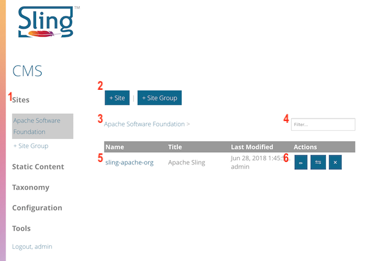
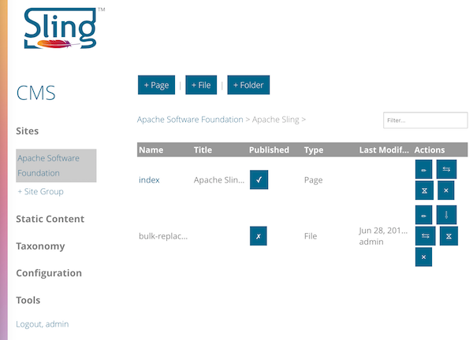
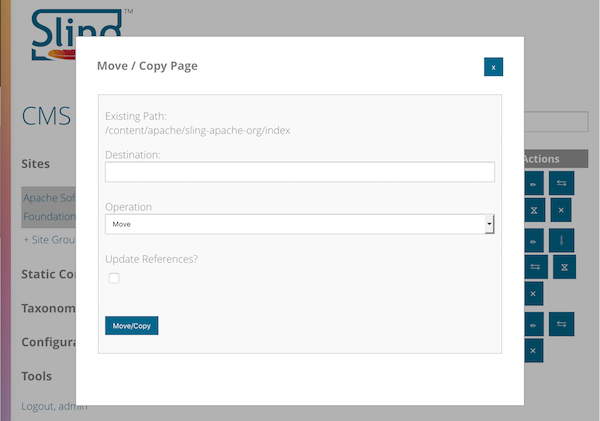
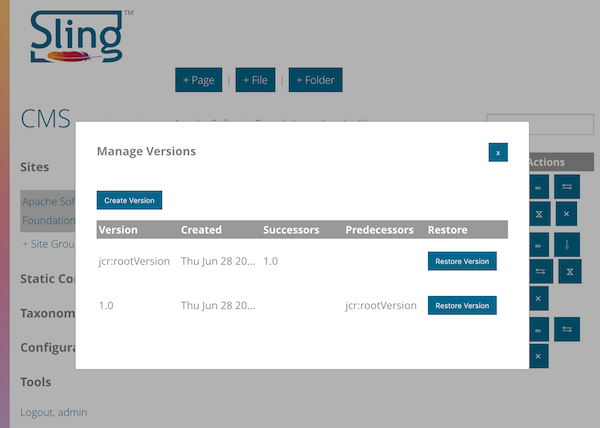
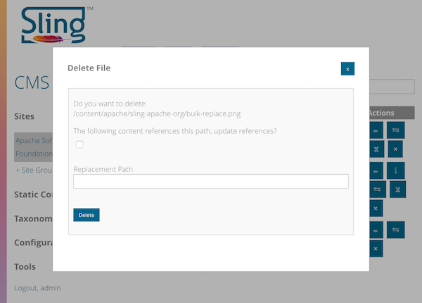

<!-- Licensed to the Apache Software Foundation (ASF) under one or more contributor 
	license agreements. See the NOTICE file distributed with this work for additional 
	information regarding copyright ownership. The ASF licenses this file to 
	you under the Apache License, Version 2.0 (the "License"); you may not use 
	this file except in compliance with the License. You may obtain a copy of 
	the License at http://www.apache.org/licenses/LICENSE-2.0 Unless required 
	by applicable law or agreed to in writing, software distributed under the 
	License is distributed on an "AS IS" BASIS, WITHOUT WARRANTIES OR CONDITIONS 
	OF ANY KIND, either express or implied. See the License for the specific 
	language governing permissions and limitations under the License. -->
[Apache Sling](https://sling.apache.org) > [Sling CMS](https://github.com/apache/sling-org-apache-sling-app-cms) > [Users](users.md) > Managing Content

# Managing Content

Consoles in Sling CMS generally follow the same pattern:

 1. The left navigation allows for switching between components of Sling CMS
 2. The create bar contains buttons to create new content
 3. The breadcrumb shows context within the content structure
 4. Filter for filtering content
 5. Table of content, clicking on the name of the item will open that item
 6. The action buttons on an individual piece of content

Sling CMS uses two main structures to store content in the repository. 

## Site Content

The first type of content is Site content. Every site belongs to a Site Group, to open the site groups, click *Sites* in the left navigation then select the site group you want to open. 

From there you can see the sites and child Site Groups that belong to the site group. Select the name of the Site or Site Group to open the Site / Site Group.

Sites can contain Pages, Files and Folders. Static content is solely static and only contains Files and Folders. 

Both Pages and Folders can contain other content. Navigate into the Page / Folder by selecting it's name.

Pages and Files can either be published or unpublished as indicated by the Published column.

Finally, the actions allow users to take actions on that content:

### Available Actions

* **Files**
    * Edit - Edit the title of the file
    * Download - Download the file
    * Move / Copy - Move or copy the file to another location in the repository
    * Manage Versions - View and create versions
    * Delete - Delete the file
* **Folders**
    * Edit - Edit the title of the folder
    * Move / Copy - Move or copy the folder to another location in the repository
    * Delete - Delete the folder
* **Pages**
    * Edit - Edit the page
    * Move / Copy - Move or copy the page to another location in the repository
    * Manage Versions - View and create versions
    * Delete - Delete the page
    
## Move / Copy Dialog

The move / copy dialog allows Sling CMS to move or copy content to another location in the repository. Set the path to which to move the content in the *Destination* field. If you select the *Move* *Operation* you can also check the box to update the references to the content.

    
## Manage Versions Dialog

The manage versions dialog allows Sling CMS to view, create and restore versions of content. 

    
## Delete Dialog

The manage delete dialog allows Sling CMS to delete content. If you check the box and set the replacement path, Sling CMS will update references to the content.

