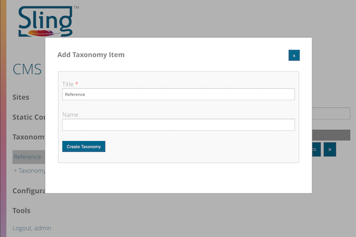
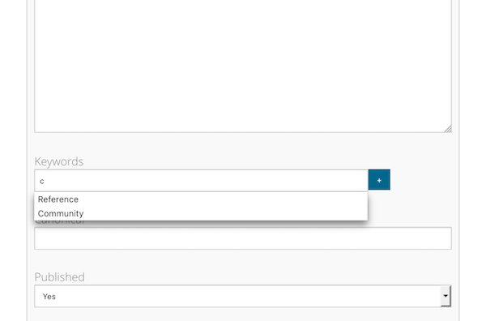

<!-- Licensed to the Apache Software Foundation (ASF) under one or more contributor 
	license agreements. See the NOTICE file distributed with this work for additional 
	information regarding copyright ownership. The ASF licenses this file to 
	you under the Apache License, Version 2.0 (the "License"); you may not use 
	this file except in compliance with the License. You may obtain a copy of 
	the License at http://www.apache.org/licenses/LICENSE-2.0 Unless required 
	by applicable law or agreed to in writing, software distributed under the 
	License is distributed on an "AS IS" BASIS, WITHOUT WARRANTIES OR CONDITIONS 
	OF ANY KIND, either express or implied. See the License for the specific 
	language governing permissions and limitations under the License. -->
[Apache Sling](https://sling.apache.org) > [Sling CMS](https://github.com/apache/sling-org-apache-sling-app-cms) > [Users](users.md) > Managing Taxonomy

# Managing Taxonomy

Taxonomy allows content to be related via a hierarchy of terms. Taxonomy items can be created in a nested structure. 

## Adding a Taxonomy Item

To create a new taxonomy item:

 - Select the Taxonomy item from the left navigation and select the taxonomy root
 - Click *+Taxonomy* to create a new Taxonomy item, this will open the taxonomy window
 - Enter the taxonomy title and name (optional) and click *Create Taxonomy*
    

Taxonomy items can be edited, moved / copied and deleted by clicking the action for the associated taxonomy item.

## Using Taxonomy

Content can use Taxonomy fields to add taxonomy items for that content based on the taxonomy. 

