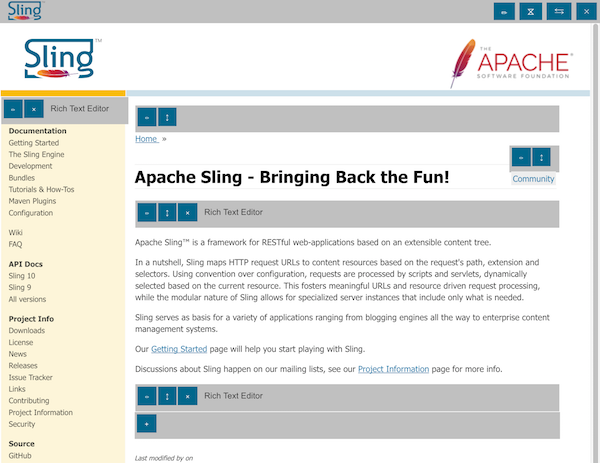
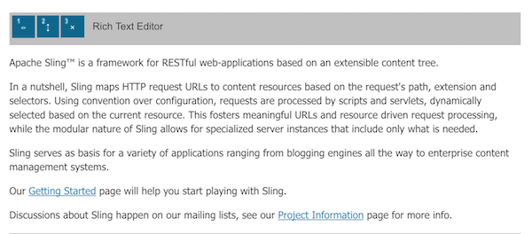
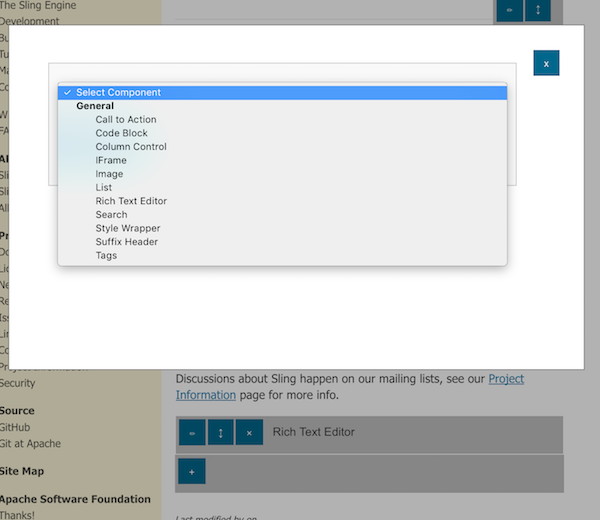

<!-- Licensed to the Apache Software Foundation (ASF) under one or more contributor 
	license agreements. See the NOTICE file distributed with this work for additional 
	information regarding copyright ownership. The ASF licenses this file to 
	you under the Apache License, Version 2.0 (the "License"); you may not use 
	this file except in compliance with the License. You may obtain a copy of 
	the License at http://www.apache.org/licenses/LICENSE-2.0 Unless required 
	by applicable law or agreed to in writing, software distributed under the 
	License is distributed on an "AS IS" BASIS, WITHOUT WARRANTIES OR CONDITIONS 
	OF ANY KIND, either express or implied. See the License for the specific 
	language governing permissions and limitations under the License. -->
[Apache Sling](https://sling.apache.org) > [Sling CMS](https://github.com/apache/sling-org-apache-sling-app-cms) > [Users](users.md) > Editing a Page

# Editing a Page

Pages in Sling CMS are composed of a page resource and a number of child components. This structure allows for a flexible and composable method of building pages. To open the page editor, click on the pencil next to a page to open the page editor. 

The page editor has two different sections, the page editor and in context editor. 

## Page Editor

The top bar contains page-level editing including the following options:

 1. Edit Properties - edit the page level properties
 2. Manage Version - view / create versions of the page
 3. Move / Copy Page - move or copy the page within the Sling repository
 4. Delete Page - delete the page
 

 
Below the top bar is the in context editor. 
 
 ## Component Editor
 
 Each component is represented by a gray bar with the name of the component with a number of actions.
 
 
 
 These actions include:
 
 1. Edit Component
 2. Reorder Components
 3. Delete Component
 
## Containers
 
Containers allow components to be added onto the page. There can be one or more containers on the page. A container is represented by a grey bar with a single + button. 
 
Click + to add a new component into the container. 
 

 
From the modal window, you can select the type of component to add. Click *Add Component* to add the component into the container.