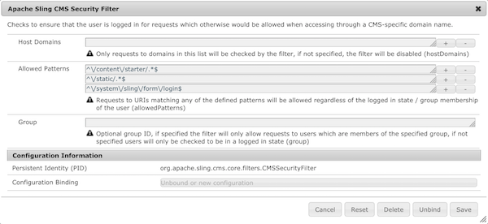
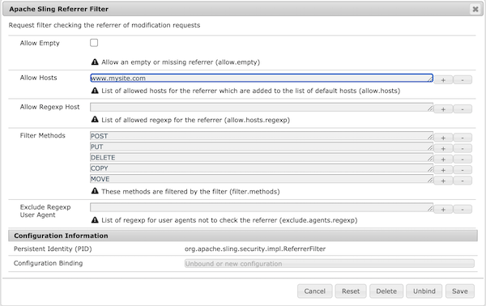

<!-- Licensed to the Apache Software Foundation (ASF) under one or more contributor 
	license agreements. See the NOTICE file distributed with this work for additional 
	information regarding copyright ownership. The ASF licenses this file to 
	you under the Apache License, Version 2.0 (the "License"); you may not use 
	this file except in compliance with the License. You may obtain a copy of 
	the License at http://www.apache.org/licenses/LICENSE-2.0 Unless required 
	by applicable law or agreed to in writing, software distributed under the 
	License is distributed on an "AS IS" BASIS, WITHOUT WARRANTIES OR CONDITIONS 
	OF ANY KIND, either express or implied. See the License for the specific 
	language governing permissions and limitations under the License. -->
[Apache Sling](https://sling.apache.org) > [Sling CMS](https://github.com/apache/sling-org-apache-sling-app-cms) > [Administration](administration.md) > Securing Sling CMS

# Securing Sling CMS

Sling CMS by default is pretty open, so you will want to secure the application with the following steps:

 1. Configure the Apache Sling CMS Security Filter - The Apache Sling CMS Security Filter  allows for limiting access to non-published content and content directly through the CMS domain. To configure the Apache Sling CMS Security Filter:
    - Open the OSGi console to [http://localhost:8080/system/console/configMgr](http://localhost:8080/system/console/configMgr/)
    - Select the plus indicator by _Apache Sling CMS Security Filter_
    - Configure the Host Domain, Allowed Patterns and, optionally, the Group required to access the CMS
       
 2. Configure the Referrer Filter - this filters which referrers are allowed send modification requests to the CMS instance. To configure the Referrer Filter:
      - Open the OSGi console at [http://localhost:8080/system/console/configMgr/org.apache.sling.security.impl.ReferrerFilter](http://localhost:8080/system/console/configMgr/org.apache.sling.security.impl.ReferrerFilter)
      - Configure the _Allow Hosts_ or _Allow Regexp Hosts_ to the host names allowed
       
 2. Configure Apache for Security - Add configurations like the ones below to make Apache HTTPD secure:
    
        # Security Protection
        Header set Content-Security-Policy	default-src https: data: 'unsafe-inline'; frame-ancestors https:
        Header set Feature-Policy * 'none'
        Header set Referrer-Policy	strict-origin
        Header set Strict-Transport-Security	max-age=15552000; includeSubDomains; preload
        Header set X-Content-Type-Options "nosniff"
        Header set X-Frame-Options SAMEORIGIN
        Header set X-XSS-Protection "1; mode=block"
        
        # Harden Apache
        ServerSignature Off
        ServerTokens Prod
        TraceEnable off
   
      Note, you should expect to tweak these based on your environment. The website [securityheaders.com](https://securityheaders.com/) is a good resource for learning about the best practices in security header configurations. 
        
 3. Ensure sites only allow specific paths - in [Configure Site](configure-site.md), you need to configure the individual site's Virtual Host in Apache. Ensure that only the required paths are proxied. This should never include paths under /etc, /system, /bin, /home or /var
 
 