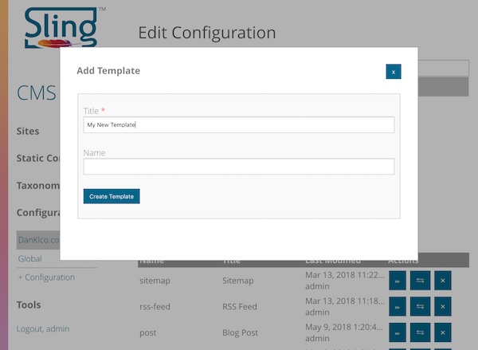
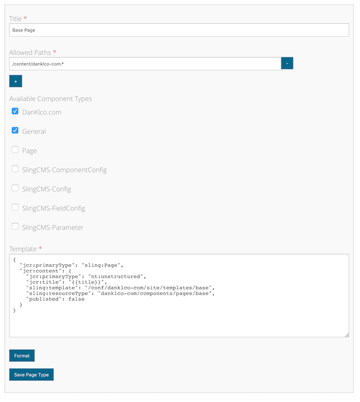
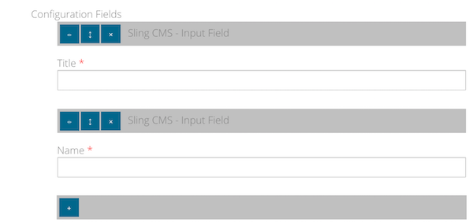
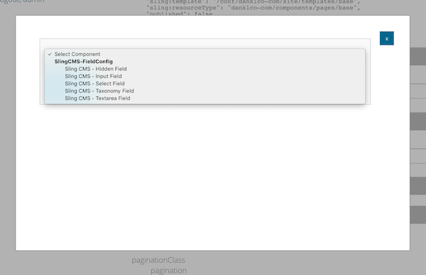

<!-- Licensed to the Apache Software Foundation (ASF) under one or more contributor
	license agreements. See the NOTICE file distributed with this work for additional
	information regarding copyright ownership. The ASF licenses this file to
	you under the Apache License, Version 2.0 (the "License"); you may not use
	this file except in compliance with the License. You may obtain a copy of
	the License at http://www.apache.org/licenses/LICENSE-2.0 Unless required
	by applicable law or agreed to in writing, software distributed under the
	License is distributed on an "AS IS" BASIS, WITHOUT WARRANTIES OR CONDITIONS
	OF ANY KIND, either express or implied. See the License for the specific
	language governing permissions and limitations under the License. -->
[Apache Sling](https://sling.apache.org) > [Sling CMS](https://github.com/apache/sling-org-apache-sling-app-cms) > [Administration](administration.md) > Templates

# Templates

Templates in Sling CMS are used to define the structure, allowed components, allowed locations and fields for pages created in Sling CMS sites.

## Creating a Template

Each template is created within a [Site Configuration](configure-site.md#site-configurations). The templates configuration should be created at the path /conf/[site_config]/site/templates with the Configuration Type "Sling CMS - Templates Configuration".

To create a new template, open *Configurations* in the left navigation and navigate into the Site Configuration.

In the Site Configuration select *+Template*. This will open a modal window to configure the new template. Set the title of the template then click *Create Template*

Once the template is created, select the pencil icon to edit the template. There are a number of fields available on the templates:

- **Title** - a title for the template
- **Allowed Paths** - Regular expressions of the paths under which a template can be created
- **Component Policies** - configure the associated [Component Policy](component-policy.md) which controls which components can be added within the template and what are their associated configurations
- **Template Content** - The content of the pages created with the template in JSON format, this can use variables from the [Configuration Fields](#configuration-fields) using [Handlebars templating](https://handlebarsjs.com/) This template should at least set the `jcr:primaryType` of the page node, the `jcr:content/sling:template` attribute (which should be the path to this template) and the `jcr:content/sling:resourceType` which is the resource type of the component to render the page

In addition to these fields, there are two other configurations:

## Configuration Fields

These fields are used to configure the pages created with the template when the page is created. Values from these fields can be referenced within the template content by name. At a minimum, you will generally have a name and title field.

To create a new configuration field, select the + button at the bottom of the container. This will open a dialog for you to select the type of configuration field to add:

Once you have selected the field, click the *Add Component* button and then select the pencil icon next to the new field to edit the field.

The different field types will have different configuration values, but generally you will have to specify a title and name for the field.
