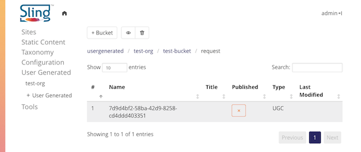
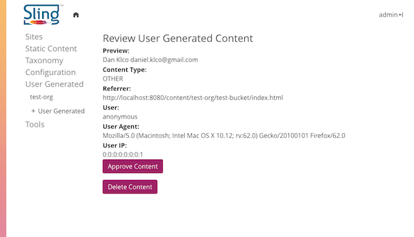

<!-- Licensed to the Apache Software Foundation (ASF) under one or more contributor 
	license agreements. See the NOTICE file distributed with this work for additional 
	information regarding copyright ownership. The ASF licenses this file to 
	you under the Apache License, Version 2.0 (the "License"); you may not use 
	this file except in compliance with the License. You may obtain a copy of 
	the License at http://www.apache.org/licenses/LICENSE-2.0 Unless required 
	by applicable law or agreed to in writing, software distributed under the 
	License is distributed on an "AS IS" BASIS, WITHOUT WARRANTIES OR CONDITIONS 
	OF ANY KIND, either express or implied. See the License for the specific 
	language governing permissions and limitations under the License. -->
[Apache Sling](https://sling.apache.org) > [Sling CMS](https://github.com/apache/sling-org-apache-sling-app-cms) > [Administration](administration.md) > User Generated Content

# User Generated Content

Sling CMS includes a console for curating User Generated Content. The content is organized into "buckets" each bucket corresponding to a form or entry method for UGC.

Content by default is not "approved" and requires manual approval. Approval can result in the content either being moved to a path specified by the creating service or in the content being set to published, depending on the approval action.

### Managing User Generated Content

User Generated Content is stored under the path */etc/usergenerated*. To manage User Generated Content, use the User Generated Content console. This can be accessed in the sidebar:

To moderate an individual piece of User Generated Content, select the content and select the eye button, this will open the UGC Approval Console from which you can approve or delete the content:

### Creating User Generated Content

To create User Generate Content, create a Servlet referencing the `UserGeneratedContentService` from the Sling CMS Core bundle.  

    @Reference
    private UserGeneratedContentService ugcService;

From this service, you can create a UGC container given a bucket configuration:

    private static final UGCBucketConfig BUCKET_CONFIG = new UGCBucketConfig();
    static {
        BUCKET_CONFIG.setAction(APPROVE_ACTION.MOVE);
        BUCKET_CONFIG.setBucket("group/site/events");
        BUCKET_CONFIG.setContentType(CONTENT_TYPE.OTHER);
        BUCKET_CONFIG.setPathDepth(0);
    }
    Resource container = ugcService.createUGCContainer(request, BUCKET_CONFIG, title + "\n\n" + summary,
        "/content/group/site/events");

The container will be created with a privileged user with access to write to the */etc/usergenerated* path, so if you make any additions to the container be sure to use that Resource's Resource Resolver. 